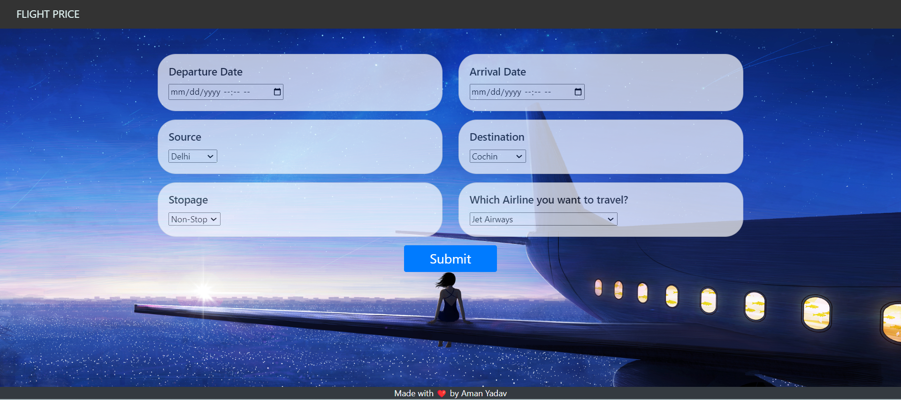

# flightpricepredict
Machine Learning Tools 
# Flight-Price-Prediction
$$$$$$$$$$$$$$$$$$$$$$$$$$$
- I did this project just to perform some next level feature engineerings to elevate the performane of this model.
- I have also created a gui using HTML,Bootstrap,CSS and implemnted the backend in Flask for this project and will be uploading that on Heroku soon.
- Actually this was a Kaggle problem.
- Also used ExtraTreeRegressor to visualize the importances of all the features.
- Just run app.py to see the gui on local host.
- Need To import requirement.txt
- Use Python 3.9
-
- Go To Kaggle for The Database
